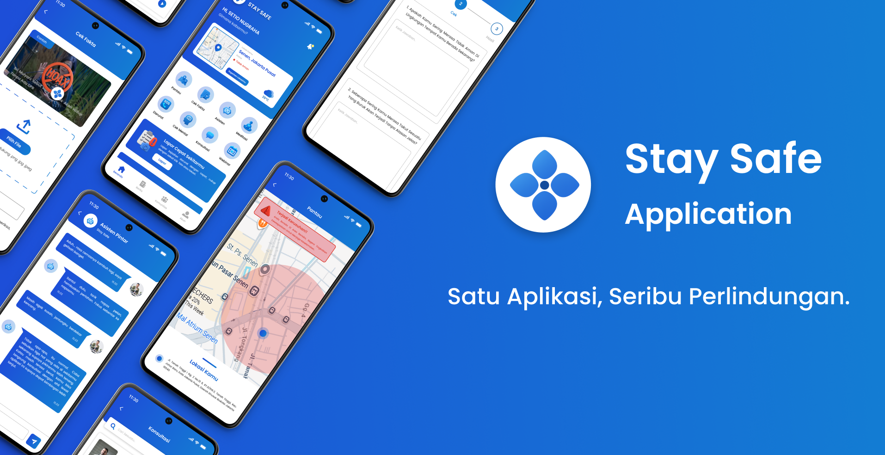

# 🛡️ Stay Safe – Aplikasi Layanan Keamanan & Kesehatan Digital Modern



---

## 🩺 Deskripsi

**Stay Safe** adalah aplikasi mobile yang dirancang untuk membantu masyarakat menghadapi tantangan keamanan dan kesehatan secara **cepat**, **tepat**, dan **responsif**.  
Aplikasi ini mengintegrasikan berbagai fitur penting seperti **pantauan lingkungan sekitar**, **jalur evakuasi**, **lapor cepat**, **cek fakta anti-hoaks**, serta **dukungan kesehatan mental** seperti meditasi, cek kondisi psikologis, dan konsultasi dengan tenaga profesional.

Dengan dukungan teknologi modern seperti AI, Machine Learning, Cloud Computing, Geolocation, dan Push Notification, Stay Safe membantu menciptakan lingkungan yang lebih **aman**, **sehat**, dan **peduli** terhadap sesama.

---

## 🚀 Teknologi yang Digunakan

| Teknologi | Deskripsi Singkat |
|-----------|-------------------|
|  **React Native** | Framework utama untuk pengembangan aplikasi mobile lintas platform dengan performa mendekati native. |
|  **NativeWind** | Styling berbasis Tailwind CSS untuk tampilan UI yang responsif dan modern. |
|  **Laravel** | Framework backend berbasis PHP dengan arsitektur MVC untuk manajemen data dan autentikasi. |
|  **Python** | Bahasa pemrograman untuk pengembangan fitur AI dan Machine Learning. |
|  **MySQL** | Database relasional untuk menyimpan data pengguna, laporan, serta riwayat aktivitas. |

---

## ✨ Fitur Utama

### 🛰️ 1. Pantau Sekitar & Jalur Evakuasi
Menampilkan peta interaktif yang menunjukkan zona aman, rawan, dan berbahaya secara real-time serta memberikan rute evakuasi terdekat untuk membantu pengguna bergerak ke titik aman dengan cepat.

---

### 🚨 2. Lapor Cepat & Tombol Darurat
Memungkinkan pengguna melaporkan situasi darurat (kerusuhan, bencana, kebakaran) hanya dengan sekali klik, lengkap dengan lokasi otomatis dan foto.  
Tombol darurat juga memberikan akses instan ke layanan penting seperti polisi atau rumah sakit.

---

### 🧠 3. Cek Fakta & Informasi Terpercaya
Membantu pengguna memverifikasi kebenaran berita dan informasi untuk mencegah penyebaran hoaks. Didukung oleh Machine Learning dan database pusat fakta terverifikasi.

---

### 🌿 4. Kesehatan Mental
Fitur meditasi, cek mental, dan konsultasi online dengan tenaga profesional untuk menjaga ketenangan pikiran, mendeteksi dini gangguan psikologis, serta memberikan pendampingan yang aman dan terpercaya.

---

### 🤝 5. Komunitas & Edukasi
Pengguna dapat saling berbagi informasi, mengikuti webinar, serta mengakses berita resmi terkait keamanan dan kesehatan untuk meningkatkan kesiapsiagaan bersama.

---

## 🧭 Cara Menjalankan Proyek

### 📱 Menjalankan Frontend (Expo React Native)
```bash
cd frontend
npm install
npm run start
